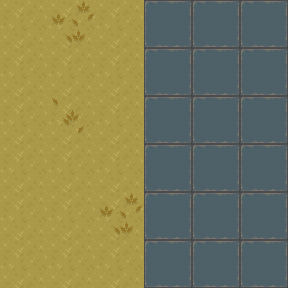
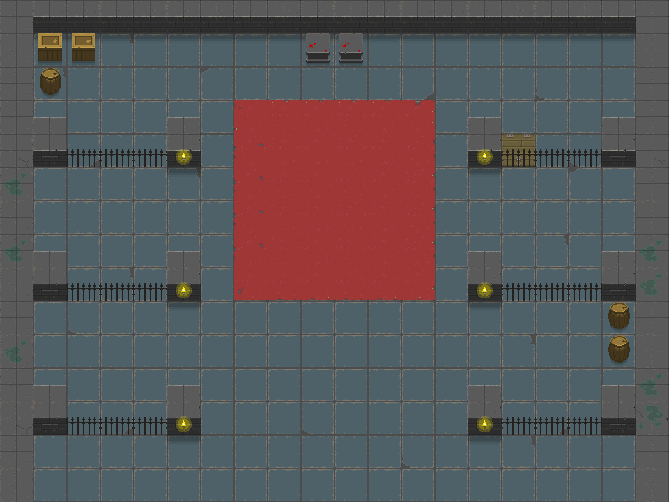

# MapMaker

Tool for converting character (ASCII, UTF-8) based maps into sprite images
when given a sprite atlas. 2D maps is the original use-case and example.

Input to the tool is a text file that describe one or more layers of a
top-down map where characters are mapped onto locations within the sprite
atlas. The input file will be parsed line by line to produce the output. A
description of the mnemonics follows in the next section.

For example (ex/example1.txt):

```
sprites <path/to/sprites.png> 48 48
image 6 6 1
srand 100

glyph . 0  145
glyph , 0  146 147 148
glyph + 0  21

0  .,.+++
1  ...+++
2  .,.+++
3  ...+++
4  ..,+++
5  ...+++
```

Will produce an image like the following:



A more complex example with multiple layers can be used to layer tiles with
alpha transparency over solid tiles. (Transparent pixels will be preserved
when writing the final image.)

For example (ex/example2.txt):



## Directive Reference

Input files will be parsed top to bottom and the first non-whitespace
character on a line will have the following behaviour:

| Mnemonic | Operands           | Description                                                                                                                                                                                        |
|----------|--------------------|----------------------------------------------------------------------------------------------------------------------------------------------------------------------------------------------------|
| sprites        | &lt;path&gt; &lt;w&gt; &lt;h&gt;     | Exactly one of this directive should appear in the input file mapping a sprite sheet location and the width and height of each sprite in pixels.                                               |
| image        | &lt;w&gt; &lt;h&gt; &lt;l&gt;        | Exactly one of this directive should appear in the input file defining output image dimensions (in tiles) and number of layers. Currently, output image will be flattened.                     |
| srand        | &lt;n&gt;                | Specify a deterministic seed value for the random number generator should tile variations be desired.                                                                                              |
| layer        | &lt;n&gt;                | Change the active layer.                                                                                              |
| glyph        | &lt;c&gt; &lt;r&gt; &lt;s...&gt; | Define a glyph for the active layer, map it to character 'c'. Rotate the selected sprite by 'r' degrees ccw. 's' is one or more indices into the sprite sheet, zero-indexed from top-leftmost tile. |
| &lt;r&gt;  | .........          | A line starting with a numeral will be parsed as a row of glyphs for the active layer. 'r' specifies the row. The remaining characters will be drawn if a corresponding glyph is mapped.  |

### Notes

- As row number is explicitly specified in the directive, for some layers
  it may not be necessary to draw every row. Only rows adding new tiles need
  be included.

- Any character in a row will occupy a space, but only mapped glyph characters
  will draw to that output layer, so if it helps visually other characters can
  be used in a layer to mark regions or tiles of interest.
